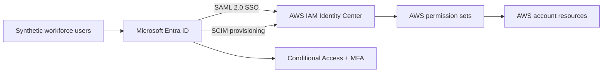
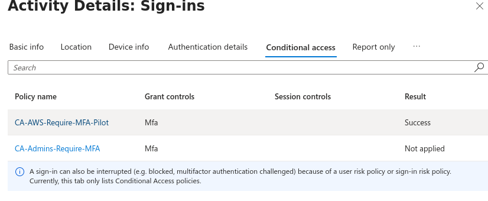

# Microsoft Entra ID to AWS IAM Identity Center Governance Lab

## Overview

This project demonstrates an enterprise-style identity integration between Microsoft Entra ID and AWS IAM Identity Center. It implements federated single sign-on, automated lifecycle provisioning, group-based access control, multifactor authentication, Conditional Access, and joiner/mover/leaver validation using synthetic users and data.

> **Portfolio note:** This repository contains sanitized documentation and evidence only. Credentials, tokens, tenant identifiers, account identifiers, IP addresses, personal addresses, and recovery information are intentionally excluded.

## Objectives

- Federate Microsoft Entra ID with AWS IAM Identity Center using SAML 2.0.
- Provision users and groups automatically through SCIM.
- Map Entra security groups to AWS permission sets.
- Enforce least privilege and MFA with Conditional Access.
- Preserve emergency administrative access while preventing lockout.
- Validate joiner, mover, leaver, allowed-action, and denied-action scenarios.
- Produce repeatable evidence suitable for audit and portfolio review.

## Architecture



## Implemented Controls

| Control | Implementation | Validation |
|---|---|---|
| Federated authentication | Entra enterprise application and AWS IAM Identity Center SAML trust | Users reached the AWS access portal through Entra authentication |
| Automated provisioning | Entra SCIM provisioning to AWS IAM Identity Center | Users and groups were created and updated by SCIM |
| Least privilege | Entra groups mapped to AWS permission sets | Users saw only their assigned AWS role |
| Read-only enforcement | `AWS-IIC-READONLY` mapped to `ReadOnlyAccess` | IAM read access succeeded; `iam:CreateUser` was denied |
| Support access | `AWS-IIC-SUPPORTOPS` mapped to `SupportUser` | Support role appeared only for the assigned group |
| MFA for AWS | `CA-AWS-Require-MFA-Pilot` | Enforced MFA during AWS federation |
| MFA for administrators | `CA-Admins-Require-MFA` | Global Administrator sign-in required MFA |
| Emergency access | Dedicated exclusion group | What If confirmed emergency account exclusion |
| Lifecycle governance | Joiner, mover, and leaver workflows | Membership, attributes, roles, and account state changed as expected |

## Identity and Access Model

| Entra group | AWS permission set | Intended access |
|---|---|---|
| `AWS-IIC-READONLY` | `ReadOnlyAccess` | View AWS resources without making changes |
| `AWS-IIC-SUPPORTOPS` | `SupportUser` | Troubleshooting and support-case activities |

Conditional Access policies:

| Policy | Scope | Control | Emergency exclusion |
|---|---|---|---|
| `CA-AWS-Require-MFA-Pilot` | Pilot users accessing the AWS enterprise application | Require MFA | Yes |
| `CA-Admins-Require-MFA` | Global Administrator role across all resources | Require MFA | Yes |

## Lifecycle Test Scenarios

### Joiner

A synthetic junior security analyst was assigned to the read-only group. The next provisioning cycle created the identity in AWS IAM Identity Center and added the correct group membership.

### Mover

A synthetic support analyst was moved to an information-security role. Read-only membership was added before support membership was removed. SCIM retained the identity, updated attributes, and changed effective AWS access without creating a duplicate account.

### Leaver

A synthetic user was blocked in Entra ID and removed from the AWS access group. SCIM disabled the AWS identity and removed group membership while retaining the account as an audit record.

## Security Validation

- A read-only user could inspect IAM resources.
- An attempted IAM user creation was denied because the role lacked `iam:CreateUser`.
- A support user initially saw only `SupportUser`.
- After the mover workflow, a new session exposed only `ReadOnlyAccess`.
- AWS federation required MFA for the pilot user.
- Entra administration required MFA for the Global Administrator.
- What If analysis confirmed that the emergency account was excluded from both enforced policies.

## Key Troubleshooting

1. **Missing email value during SCIM provisioning**  
   Cloud-only synthetic users did not have an Exchange-backed `mail` attribute. The SCIM email mapping was changed from `mail` to `userPrincipalName`, allowing successful provisioning.

2. **Group assignment unavailable in the enterprise application**  
   Group assignment required Microsoft Entra ID Premium. A P2 trial was activated and licenses were assigned only to lab users who required premium features.

3. **Conditional Access What If returned no policy**  
   The administrator policy initially targeted the `Groups Administrator` role and agent resources. It was corrected to `Global Administrator` and `All resources (formerly All cloud apps)`.

4. **Successful SAML continuation displayed Conditional Access as not applied**  
   The preceding interrupted sign-in event contained the successful MFA policy evaluation. The later success event represented the continuation after MFA had already been satisfied.

See [Troubleshooting Notes](documentation/troubleshooting.md) for additional detail.

## Evidence

The sanitized evidence set is designed to demonstrate:

- SCIM-created users and groups
- Successful provisioning cycles
- Group-to-permission-set assignments
- Read-only authorization denial
- Joiner, mover, and leaver state changes
- Conditional Access What If results
- Enforced MFA policy success

See [Evidence Checklist](evidence/README.md) before publishing images.

### Evidence Gallery

#### SCIM-created identities

Usernames and the tenant domain are intentionally redacted. The view preserves the synthetic display names, enabled status, and `Created by: SCIM` result.


#### SCIM-created groups


#### Group-based permission assignments


#### Least-privilege denial

The principal and resource identifiers are intentionally redacted. The authorization result confirms that the read-only session could not perform `iam:CreateUser`.


#### Enforced Conditional Access MFA



## Skills Demonstrated

- Microsoft Entra ID administration
- AWS IAM Identity Center administration
- SAML 2.0 federation
- SCIM lifecycle provisioning
- Conditional Access and MFA
- Role-based access control and least privilege
- Joiner/mover/leaver governance
- Access testing and troubleshooting
- Audit-focused documentation

## Limitations

- This is a controlled portfolio lab, not a production deployment.
- The AWS environment uses one organization management account.
- Synthetic identities and non-production data are used throughout.
- Some Entra capabilities depend on time-limited trial licensing.
- Public evidence is intentionally redacted and cannot expose live identifiers or secrets.

## Repository Structure

```text
.
├── README.md
├── SECURITY.md
├── architecture/
│   └── architecture.md
├── documentation/
│   ├── test-results.md
│   └── troubleshooting.md
└── evidence/
    └── README.md
```

## Disclaimer

This project is an independent educational lab. It is not affiliated with or endorsed by Microsoft, Amazon Web Services, or any employer. All people and organizational data used in the documented scenarios are synthetic.
