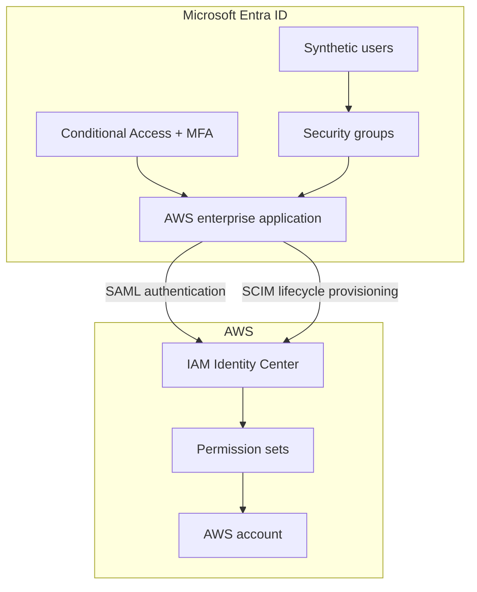

# Architecture

## Trust and Data Flows

| Flow | Source | Destination | Purpose |
|---|---|---|---|
| SAML 2.0 | Microsoft Entra ID | AWS IAM Identity Center | Federated user authentication |
| SCIM | Microsoft Entra provisioning service | AWS IAM Identity Center | Create, update, disable, and group identities |
| Group assignment | Entra security groups | AWS permission-set assignments | Role-based access control |
| Conditional Access | Entra policy engine | AWS and administrative sign-ins | Enforce MFA and preserve emergency access |
