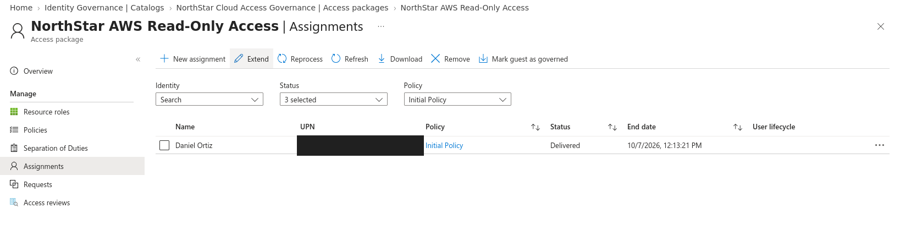
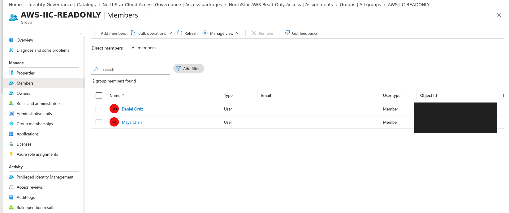
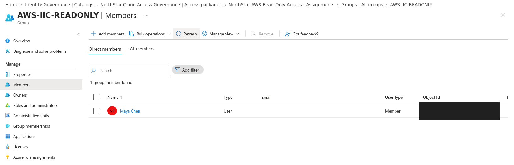

# Entitlement Management access-package validation

## Outcome

Microsoft Entra Entitlement Management was used to govern temporary membership in the `AWS-IIC-READONLY` security group. A synthetic internal user requested the `NorthStar AWS Read-Only Access` package, supplied a business justification, received administrator approval, and was automatically added to the governed group. Removing the assignment revoked that membership, completing the request-to-removal lifecycle.

This validation extends the Entra-to-AWS lab from static group assignment to policy-controlled, time-limited access delivery.

## Configuration

| Component | Validated configuration |
|---|---|
| Catalog | `NorthStar Cloud Access Governance` |
| Access package | `NorthStar AWS Read-Only Access` |
| Governed resource | `AWS-IIC-READONLY` security group |
| Resource role | Member |
| Requestors | Selected internal synthetic user |
| Request method | Self-service request |
| Requestor justification | Required |
| Approval | One stage |
| Approver | Lab IAM administrator |
| Approver justification | Required |
| Decision window | 3 days |
| Assignment duration | 2 hours |
| Assignment email | Enabled |

Verified ID requirements, external-user access, custom extensions, and automatic access reviews were intentionally excluded from this test. Access reviews were validated separately in the same lab.

## Validation procedure

1. Added the `AWS-IIC-READONLY` group to the internal catalog.
2. Created an access package that granted the group’s Member role.
3. Limited requests to a selected synthetic internal user.
4. Required requestor and approver justifications.
5. Configured a two-hour assignment lifetime.
6. Submitted the request through My Access.
7. Approved the pending request as the lab IAM administrator.
8. Confirmed the assignment reached **Delivered** status.
9. Confirmed the synthetic requestor appeared as a direct member of `AWS-IIC-READONLY`.
10. Removed the assignment and confirmed the user disappeared from the group.

## Evidence

### Assignment delivered

The assignment reached **Delivered** status under the access-package policy. The synthetic user principal name is redacted.

### Governed group membership granted

The synthetic requestor appeared in `AWS-IIC-READONLY` after approval and delivery. Object identifiers and the administrator identity are redacted.

### Governed group membership revoked

After the assignment was removed, only the pre-existing synthetic member remained. This confirms that access removal propagated to the governed group.

## Security value

- Replaced informal direct group assignment with a documented request and approval workflow.
- Enforced least privilege by granting only the group tied to AWS read-only access.
- Limited standing access with a short assignment lifetime.
- Preserved requestor and approver justifications for auditability.
- Demonstrated deprovisioning by removing the entitlement and verifying downstream group membership removal.

## Limitations

- This was a controlled test in a personal lab using synthetic identities.
- The test validated Entra group membership delivery and revocation; it did not measure the exact timing of downstream SCIM removal in AWS IAM Identity Center.
- A single approver was used; production environments may require multiple stages or separation-of-duties controls.
- The assignment was manually removed before natural expiration to validate revocation during the test window.
- Trial licensing was used for premium governance capabilities.

## Skills demonstrated

Microsoft Entra Entitlement Management, access-package design, catalog administration, approval workflows, just-in-time access, least privilege, entitlement lifecycle testing, access revocation, and audit-focused documentation.
